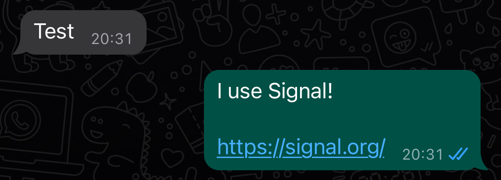

# whatsapp-responder
A simple script which automatically responds to new WhatsApp messages

## Current functions:
- send a "I use Signal" message everytime a new message received

## Story behind
I dont use WhatsApp and don't like it so i wrote this simple script which is a copypasta from [whatsapp-web.js](https://wwebjs.dev/) docs to answer with a "I use Signal" message everytime a new message is received.

## Setup
- clone project
- install dependecies using `npm i`
- start script using `npm start`
- authentificate using qr code which is displayed in shell

To run the script without interuption on a server or raspberry pi simply install [pm2](https://pm2.keymetrics.io/) and 
- start script using `pm2 start npm --name "WhatsApp responder" -- start`
- stop script using `pm2 stop "WhatsApp responder"`
- remove script from pm2 `pm2 remove "WhatsApp responder"`